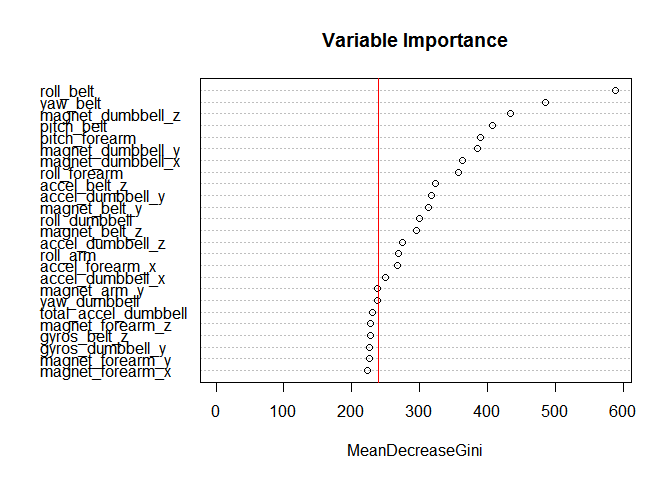
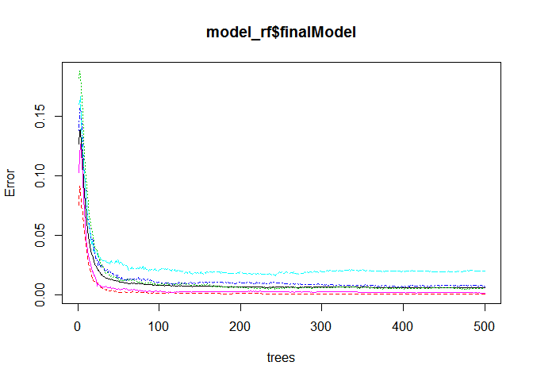

# Predicting the Class of Weight Lifting Exercises

### Background

Using devices such as Jawbone Up, Nike FuelBand, and Fitbit it is now possible to collect a large amount of data about personal activity relatively inexpensively. These type of devices are part of the quantified self movement – a group of enthusiasts who take measurements about themselves regularly to improve their health, to find patterns in their behavior, or because they are tech geeks. One thing that people regularly do is quantify how much of a particular activity they do, but they rarely quantify how well they do it. In this project, your goal will be to use data from accelerometers on the belt, forearm, arm, and dumbell of 6 participants. They were asked to perform barbell lifts correctly and incorrectly in 5 different ways. More information is available from the website here: http://groupware.les.inf.puc-rio.br/har (see the section on the Weight Lifting Exercise Dataset). 

### Goal

This study involves exploring weight lifting exercise data. There are 160 variables (columns in the data). Each observation is classified with "classe" variable, which has 5 levels: A, B, C, D, E. The goal of this study is to come up with a prediction algorithm to accurately predict the class for each observation.

### Approach

1. Divide the training set into 2 sets - 80:20 (train, test).  
2. Use training set for training random forest model.
3. Predict and create ConfusionMatrix on **test set** to measure performance of model.
4. Predict using the best performing model in Step 3, classification for 20 test samples. Create the submission files

### Load data and pre process

We load the data and inspect it. Inspection of the data showed that there are many columns mostly with NA and empty values. Clearly, we need to remove those variables from our study, as they will not provide any information for the prediction algorithm. This step also removes some observations where "DIVby0" error is detected. Luckily, those errors occur in the variables with mostly NA and blank values. Since we do this cleaning in training data set, we should do the same for testing data set.


```r
library(caret) 
```

```
## Loading required package: lattice
## Loading required package: ggplot2
```

```r
library(foreach)
library(doSNOW)
```

```
## Loading required package: iterators
## Loading required package: snow
```

```r
ncores <- 2
set.seed(1234)
```


```r
setwd("C:\\Users\\Chakri\\Desktop\\Coursera\\Practical Machine Learning")
download.file("http://d396qusza40orc.cloudfront.net/predmachlearn/pml-training.csv",
              destfile="pml-training.csv",
              mode="wb")
# load data
rawData <- read.csv("pml-training.csv", na.strings=c("", "NA", "#DIV/0!"))
# discard NAs
na.count <- apply(rawData, 2, function(x) {sum(is.na(x))}) 
validData <- rawData[, which(na.count == 0)]

# remove useless predictors
removeColumns <- grep("timestamp|X|user_name|new_window|num_window", names(validData))
validData <- validData[ ,-removeColumns]

# make training set 80
trainIndex <- createDataPartition(y = validData$classe, p=0.80, list=FALSE)
trainData  <- validData[trainIndex, ]
testData   <- validData[-trainIndex, ]

classeColumnIndex <- grep("classe", names(testData))
dim(trainData); dim(testData)
```

```
## [1] 15699    53
```

```
## [1] 3923   53
```

### Prediction Modeling

We decided to use random forest algorithm. We utilize 10-fold cross-validation to train algorithm.


```r
# power up cluster
cl <- makeCluster(ncores)
registerDoSNOW(cl)

cv_opts <- trainControl(method="cv", number=10, allowParallel=TRUE)

# run randomforest model
system.time(
        model_rf <- train(classe ~ ., data = trainData, 
                method="rf", trControl = cv_opts)
        )
```

```
##    user  system elapsed 
##   68.83    1.49 1968.94
```

```r
# stop cluster
stopCluster(cl)

model_rf
```

```
## Random Forest 
## 
## 15699 samples
##    52 predictors
##     5 classes: 'A', 'B', 'C', 'D', 'E' 
## 
## No pre-processing
## Resampling: Cross-Validated (10 fold) 
## 
## Summary of sample sizes: 14129, 14128, 14130, 14132, 14129, 14127, ... 
## 
## Resampling results across tuning parameters:
## 
##   mtry  Accuracy  Kappa  Accuracy SD  Kappa SD
##   2     1         1      0.002        0.003   
##   30    1         1      0.002        0.003   
##   50    1         1      0.002        0.003   
## 
## Accuracy was used to select the optimal model using  the largest value.
## The final value used for the model was mtry = 2.
```

Apply the model on the train data set and see how it performs.


```r
preds_rf_train <- predict(model_rf, trainData[, -classeColumnIndex])
confusionMatrix(preds_rf_train, trainData[, classeColumnIndex])
```

```
## Confusion Matrix and Statistics
## 
##           Reference
## Prediction    A    B    C    D    E
##          A 4464    0    0    0    0
##          B    0 3038    0    0    0
##          C    0    0 2738    0    0
##          D    0    0    0 2573    0
##          E    0    0    0    0 2886
## 
## Overall Statistics
##                                 
##                Accuracy : 1     
##                  95% CI : (1, 1)
##     No Information Rate : 0.284 
##     P-Value [Acc > NIR] : <2e-16
##                                 
##                   Kappa : 1     
##  Mcnemar's Test P-Value : NA    
## 
## Statistics by Class:
## 
##                      Class: A Class: B Class: C Class: D Class: E
## Sensitivity             1.000    1.000    1.000    1.000    1.000
## Specificity             1.000    1.000    1.000    1.000    1.000
## Pos Pred Value          1.000    1.000    1.000    1.000    1.000
## Neg Pred Value          1.000    1.000    1.000    1.000    1.000
## Prevalence              0.284    0.194    0.174    0.164    0.184
## Detection Rate          0.284    0.194    0.174    0.164    0.184
## Detection Prevalence    0.284    0.194    0.174    0.164    0.184
## Balanced Accuracy       1.000    1.000    1.000    1.000    1.000
```

Woh, thats pretty good accuracy. So we are glad we pick random forest.


```r
imp <- varImp(model_rf$finalModel)
varImpPlot(model_rf$finalModel,
main="Variable Importance",
sort=TRUE,
n.var=25)
abline(v=mean(imp$Overall),col="red")
```

 

In an extended version, we can include a prediction algorithm with only these top variables (instead of all 52 variables) and determine its accuracy. But we have already exceeded the limitation of this report. The following plot shows how the accuracy of the algorithm affected by the number of trees used.


```r
plot(model_rf$finalModel)
```

 

### Model Testing


```r
preds_rf <- predict(model_rf, testData[, -classeColumnIndex])
confusionMatrix(preds_rf, testData[, classeColumnIndex])
```

```
## Confusion Matrix and Statistics
## 
##           Reference
## Prediction    A    B    C    D    E
##          A 1113    3    0    0    0
##          B    3  755    7    0    0
##          C    0    1  677   11    0
##          D    0    0    0  632    0
##          E    0    0    0    0  721
## 
## Overall Statistics
##                                         
##                Accuracy : 0.994         
##                  95% CI : (0.991, 0.996)
##     No Information Rate : 0.284         
##     P-Value [Acc > NIR] : <2e-16        
##                                         
##                   Kappa : 0.992         
##  Mcnemar's Test P-Value : NA            
## 
## Statistics by Class:
## 
##                      Class: A Class: B Class: C Class: D Class: E
## Sensitivity             0.997    0.995    0.990    0.983    1.000
## Specificity             0.999    0.997    0.996    1.000    1.000
## Pos Pred Value          0.997    0.987    0.983    1.000    1.000
## Neg Pred Value          0.999    0.999    0.998    0.997    1.000
## Prevalence              0.284    0.193    0.174    0.164    0.184
## Detection Rate          0.284    0.192    0.173    0.161    0.184
## Detection Prevalence    0.284    0.195    0.176    0.161    0.184
## Balanced Accuracy       0.998    0.996    0.993    0.991    1.000
```

As you can see, the accuracy is 99.4%[]=-. This means the out-sample error is 0.6%. This is a pretty good result.

### Results

We have the best prediction from Random Forest, so we select Random Forest as our final model.

### Predicting outcome on given 20 test cases

```r
download.file("http://d396qusza40orc.cloudfront.net/predmachlearn/pml-testing.csv",
              destfile="pml-testing.csv",
              mode="wb")

# Predict the outcomes in the given test file
classetestData <- read.csv("pml-testing.csv", na.strings=c("", "NA", "#DIV/0!"))
removeColumns <- grep("timestamp|X|user_name|new_window|num_window", names(classetestData))
classetestData <- classetestData[ ,-removeColumns]
answers <- predict(model_rf, classetestData)
answers
```

```
##  [1] B A B A A E D B A A B C B A E E A B B B
## Levels: A B C D E
```

```r
# write output to files

pml_write_files <- function(answers){
        x <- as.character(answers)
        n = length(x)
        for(i in 1:n){
                filename = paste0("problem_id_",i,".txt")
                write.table(x[i],file=filename,quote=FALSE,row.names=FALSE,col.names=FALSE)
        }
}

pml_write_files(answers)
```
